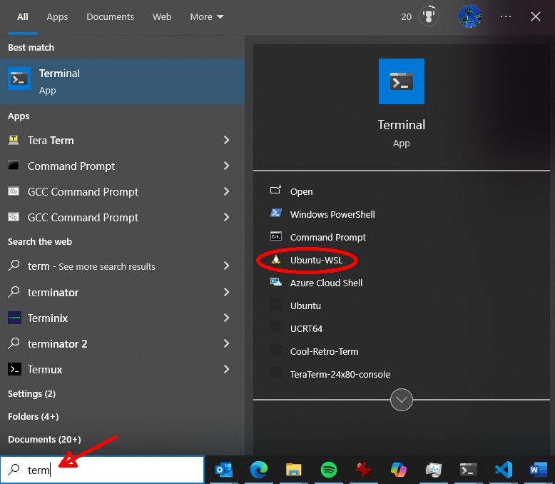
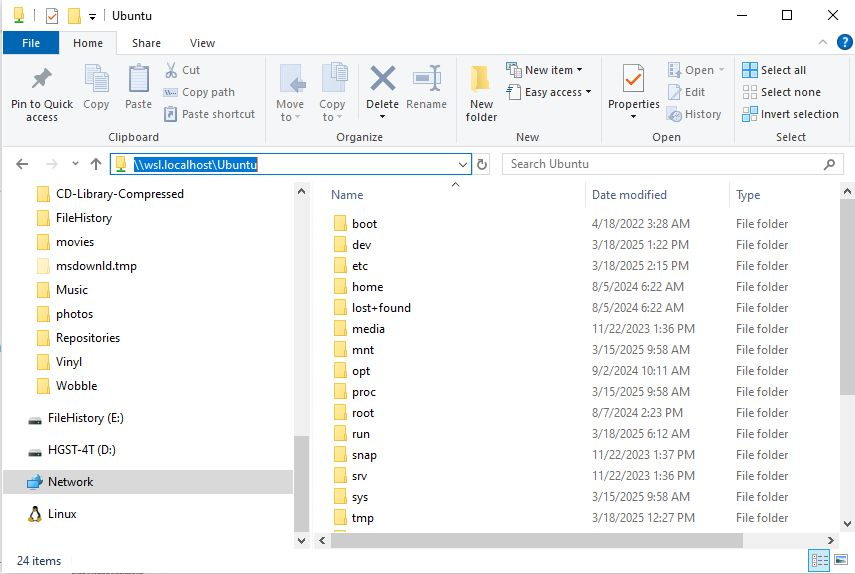
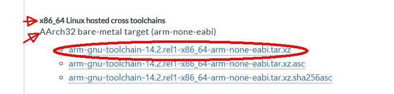
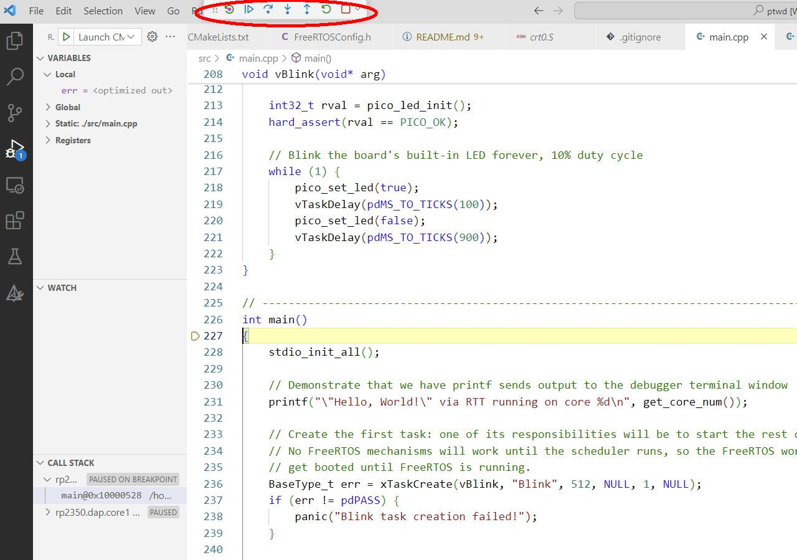

# Goal

The goal of this repo is to show you how to create a basic debuggable "hello, world" C/C++ project for Raspberry Pi Pico boards (Pico or Pico2, regular or wireless versions).

Visual Studio Code will be the IDE for the development environment.
The development environment is linux-centric, but can easily run on a Windows machine by using Windows Subsystem for Linux (WSL2).

There is a fair bit of software to install, and there are a lot of steps.
A lot of this is due to the fact that we will be 'cross compiling', meaning that the compiler toolchain does not generate code for the host machine's processor, but the target processor on the Pi Pico board.

Don't worry, we will get through all of it!

## Development System Overview

The development system to be created has been tested on three different OS/machine combinations:

1) an x86-64 Windows machine running Ubuntu via Windows Subsystem for Linux (WSL2)
1) an x86-64 machine running Linux Mint 22
1) a ARM-based Raspberry Pi 5 running Raspberry Pi OS, its own flavor of Linux

The development system should work on MacOS, but I don't have access to a Mac to test that out.

Once the tools are installed, all project development will occur directly within the VS Code Integrated Development Environment (IDE): editing, building, flashing, and debugging of the hardware.
VS Code is available for x86 and ARM, and runs under Windows WSL2 as well as other linux distros.
It might be possible to use an IDE other than VS Code, but you are on your own if you do.
Part of that is because certain aspects of the build/run/debug process are baked into VS Code setup files and extensions.
If you _really_ want to use a different IDE, then I will assume that you are capable of figuring out what you need to do based on the VS Code instructions that follow.

## Prep The Development System

The list of the high-level steps to get a build system working on Windows is shown below.
It's a long list, but it's not overly difficult, and it only needs to happen once.

The instructions assume that you will be using a Window machine and running WSL2 linux under Windows.
If you choose to build the system on a pure Linux machine instead of Windows/WSL2, then you probably already know what you are doing and can figure out what you should be doing based on these instructions.

* [Install WSL2](#install-wsl2)
  * WSL2 Ubuntu Linux
  * Environment Variables
* [Windows Terminal App](#windows-terminal-app)
* [Install VS Code](#vs-code)
  * Install a bunch of VS Code extensions
* [Install Linux software](#linuxwsl2-software-installation)
  * Git
  * C/C++ cross compilers (to create Arm Cortex code that runs on the Pico hardware)
  * GDB (GNU debugger), for debugging ARM Cortex code
  * CMake, which creates the build system for ptwd project
  * Ninja, used by CMake to drive the actual build process
* [Prepare a 'projects' directory in Linux](#project-development-setup)
  * Install this project from github
  * Install Pi Pico software
    * Raspberry Pi Pico-SDK
    * FreeRTOS for Pi Pico

Once all the software is successfully installed, you will be able to use VS Code to:

* Configure your build
* Build the project software
* Use a hardware debugger to flash the code onto a Pico board

It will be a bit of a trek to get there, but here we go...

The following sections detail how to do the items listed, above.

## Install WSL2

WSL (Windows Subsystem for Linux) runs a virtualized linux kernel inside Windows.
If you haven't used WSL2 before, it's a real linux kernel running in a Windows virtual environment.
There is no need to do things like dual-boot Windows/Linux or anything like that: Windows and WSL2 run simultaneously, side-by-side.

The WSL2 installation process is defined [here](https://learn.microsoft.com/en-us/windows/wsl/install).
Follow those instructions and all will be well.
But here is the short version. In the standard windows search box, type 'powershell'. Select the option to "run as administrator".
 When the window opens, type the following commands:

```bash
wsl --install
wsl --install -d Ubuntu
```

The first install installs WSL2 itself.
The second install installs a generic Ubuntu distro.

There are other distro choices, but the instructions that follow might have some very minor dependencies on you installing Ubuntu. To see the other choices available directly from Microsoft sources, type:
```bash
wsl --list --online
```

## Windows Terminal App

Once WSL2/Ubuntu has been installed, go to the Microsoft store and download the "[Windows Terminal](https://apps.microsoft.com/detail/9n0dx20hk701?hl=en-us&gl=US)" free app.
Terminal works great for interacting with WSL2.
It supports multiple terminal windows using a tabbed interface which is nice.

**Note:** From this point on, any of the instructions in this document that are executed from a Linux command line will be using a Windows Terminal window that is running Ubuntu/WSL.

* Open the terminal app by typing 'terminal' into the Windows search box.
* On the title bar, click the small down-arrow to get a bunch of options.
* Find the 'settings' option and click it.
* At the bottom left of the settings screen, you will see "Add New Profile".
Click that.
* Add a new empty profile.
Give it a name, like 'wsl-Ubuntu'.
* Change the 'command line' option to be '%SystemRoot%\System32\wsl.exe -d Ubuntu'.
* In the Starting Directory option, uncheck the 'Use Parent Process Directory' option.
* Enter '~' as the starting directory.
* Click 'save'

There are other options you can play with (like fonts and colors), but those mentioned above are the required options to be changed.

If you click the same little down arrow on the title bar now, you will see a new entry with the name you entered earlier: 'wsl-Ubuntu'.
Click the 'wsl-ubuntu' selection.

The linux boot will takes a few seconds the very first time that it runs.
You will be asked for a user name and password for your initial Ubuntu user account.
You can use the same user name as your windows accout, or create a different user name.
The new user name is used by linux only.
The new user name will automatically be given 'sudo' privileges.

From this point on, when you type 'terminal' in the windows search box, you will have the option to directly select your new Ubuntu distro:



Use a terminal window to get your new WSL2 Linux system up to date by typing:

```bash
sudo apt update
sudo apt upgrade
```

The first time around, these commands may install a bunch of updates.
You should run this command pair once in a while to keep your Linux distro up-to-date for application updates and security patches.

### WSL and Windows Filesystems

Both WSL and Windows run simultaneously, but each has its own separate filesystem.
Even so, WSL2 arranges for the two filesystems get cross-mounted so that each one is accessable from the other.

From Windows, the root of all the distros that may be installed is located at '\\wsl$' or \\wsl.localhost'. Appending the distro name takes you to the root of that distro's filesystem, as shown below:



Going the other way is just as easy.
In Ubuntu, each Windows drive letter automatically gets mounted under '/mnt'.
Doing an 'ls -l /mnt/c' in a linux terminal window will show you the contents of your top-level directory on Windows drive 'C:'.

Linux commands like 'cp' or 'mv' operate seamlessly on both filesystems.
If you are a linux person, it's nice to be able to use linux commands like 'find' and 'grep' on the directories inside your Windows machine.

## Windows Software Installation

There are a few programs that need to be installed on the development host.

### VS Code

VS Code is a software IDE (Integrated Development Environment) that runs in Windows.
Basically, it is an extremely powerful text editor, with all kinds of additions to help you develop writing code.
One feature of VS Code is that it can edit from remote sources.
If VS Code is running on a Windows machine, as a Windows executable, it will seamlessly connect to the 'remote' WSL2 linux environment on the same machine to allow you to edit the project files in the linux filesystem.

Official Microsoft installation instructions are located [here](https://code.visualstudio.com/docs/setup/windows).
If that link goes dead, just google 'installing VS Code', and find a Microsoft link that tells you how to do it.

If you are developing strictly on a linux machine, VS Code can be installed as a native linux app using .deb or .rpm mechanisms.
Google for the VS Code linux download page and there will be instructions.

Once you have VS Code installed, you need to add a bunch of extensions, as described in the next section.

#### VS Code Extensions

One of VS Code's best features is that it is amazingly extensible.
People all over the world write useful "extensions" that add new features to the editor.
This project needs a bunch of extensions to be installed.
To install the extensions, start VS Code.
You don't need to open any files or directories at this point.
Click the 'extensions' icon on the left side ribbon.
The 'extensions' icon looks like 3 boxes with a 4th box floating above the 3 boxes.
Once you find that icon, click it.
It will open a search box that says 'Search Extensions in Marketplace'.
There are a bunch to install!
As you search for each one from the list below, it will give you an option to install it. Install each one in turn:

* C/C++ (by Microsoft)
* C/C++ Extension pack (by Microsoft)
* Cortex-debug
* MemoryView
* RTOS Views
* Markdown Preview Github Styling
* markdownlint

The C/C++ Extension Pack should install a couple of other extensions, namely: CMake, CMake Tools, and Themes.

Note that these extensions run as windows apps on Windows versions of VS Code and as linux apps on either linux versions of VS Code, or Windows versions of VS Code that are using a remote connection to a linux machine.
What this means is that you might need to install linux versions of these extensions later, if you use Windows in its remote editor mode.
We will cover that later.

## Linux/WSL2 Software Installation

Before starting the installation process for all of the Linux software, make sure your linux machine (virtual or otherwise!) is up to date, as described earlier:

```bash
sudo apt update
sudo apt upgrade
```

## Create a Local Bin Directory

This project creates a few special executables to help build the software.
Rather than put these tools in the standard system-wide installation locations,
the build system will place them in a user-specific "~/.local/bin directory".

If that directory does not exist, use your terminal window to create it via the following:

```bash
mkdir -p ~/.local/bin
```

The standard Ubuntu "~/.profile" you got with your fresh distro will automatically add your new "~/.local/bin" directory to the PATH variable.
Check your PATH to see if the "~/.local/bin" directory is on it:

```bash
echo $PATH|tr ':' '\n'|grep '[.]local'
/home/<your-user-name>/.local/bin
```

If the directory is not on your PATH, log out and log in again so that your "~/.profile" gets re-executed.
Typically, the "~/.profile" will only add "~/.local/bin" to your PATH if the directory exists.
If your .profile is not adding "~/.local/bin" to your path, edit your .profile to add the following lines:

```bash
# set PATH so it includes user's private bin if it exists
if [ -d "$HOME/.local/bin" ] ; then
    PATH="$HOME/.local/bin:$PATH"
fi
```

Log out and log in again by closing the Ubuntu terminal window, then opening a new one.
Verify that '~/.local.bin' is on your PATH.

### Install GCC/G++

GCC should come preinstalled on the fresh linux distro.
It is harmless to reinstall it though.
G++ (the C++ compiler) is typically not pre-installed, so make sure to install it as below:

```bash
sudo apt install gcc
sudo apt install g++
```

Edit your ~/.bashrc file to add the following line at the end of the file:

```bash
export CXX=/usr/bin/g++
```

The Pico SDK requires that the CXX environment variable be defined so that it can find a __host__ C++ compiler (i.e. not a cross-compiler) to build the pioasm tool.
The pioasm tool runs as a host application.

### Install Git

Git is a source-code control system used for managing large projects.
It should already be installed in your generic WSL2 Ubuntu distribution, but it is harmless to make sure, as shown below.
If you see the message of the form 'git is already the newest version' (as shown below), it means git was already installed.

```bash
$ sudo apt install git
Reading package lists... Done
Building dependency tree... Done
Reading state information... Done
git is already the newest version (1:2.34.1-1ubuntu1.11).
0 upgraded, 0 newly installed, 0 to remove and 0 not upgraded.
```

#### Git and Line Endings

The project's Git repository always has Unix-style LF line endings.
Configuring the git setting 'core.autocrlf' to 'false' tells Git to *not* change files to use CRLF-style endings when it checks stuff out onto a Windows machine.
VS Code on Windows operates just fine on LF-style endings so there is no need to add CR characters just because it is a Windows machine.

To avoid the whole CR mess when working with Windows, type the following in your WSL2 terminal window:

```bash
git config --global core.autocrlf false
```

### Misc Tools

The ninja installation will require unzip:

```bash
sudo apt install unzip
```

### Install ARM Cross-Compiler Toolchain

ARM cross compilers are required to build code for the ARM processors on a Pi Pico.
To get the Arm cross-compiler software installed, start off by downloading an appropriate toolchain from the Arm download page located [here](https://developer.arm.com/downloads/-/arm-gnu-toolchain-downloads).

#### Preparing a Tools Directory

We need to prepare a place for the cross-compilation tools to live.
If you have your own favorite way of doing things like this, do it your way.
Note that if you *do* change where you want to put the tools, you will need to update the project file 'projects/ptwd/cmake/toolchains/arm-none-eabi.cmake' to reflect your changes.
Otherwise, this is my recommended way:

```bash
# This assumes that the latest version was named 14.2.rel1:
sudo mkdir -p /opt/arm/arm-none-eabi/14.2.rel1
```

The point of this directory structure is to allow multiple versions of the toolchain to live on your system.
When we are done, the toolchain directory will look like this (perhaps with a different version number):

```text
/opt
└── arm
    └── arm-none-eabi
        └── 14.2.rel1

```

In the future, when some new, hypothetical version 20.1 of the tools gets released, you could download that new toolchain beside the current 14.2 directory.
The resulting directory structure would look like this:

```text
/opt
└── arm
    └── arm-none-eabi
        └── 14.2.rel1
        └── 20.1.rel1
```

You will be able switch over to the new tools or switch back to the old ones by just changing an appropriate CMake toolchain file to point at the proper directory.
This really helps keeping old projects alive when some new release breaks compatibilty with your old project: the old project can just continue to use the old tools.

Now that the toolchain has a place to live, it's time to get it, then install it.

#### Tools For x86 PC

Assuming that your PC host is an x86 machine capable of running linux/WSL2, scroll down until you see the section called:

```x86_64 Linux hosted cross toolchains```

Inside that section, you will see a heading:

```AArch32 bare-metal target (arm-none-eabi)```

What you are looking for is:

```arm-gnu-toolchain-14.2.rel1-x86_64-arm-none-eabi.tar.xz```

Pictorially, you are looking for this entry on the webpage:



The version number in the example (14.2.rel1) may have changed since this document was last updated, so just locate the most recent version, whatever it is.
Don't download the file though, just right click the link and select "copy link", then skip to [Downloading & Installing](#downloading--installing)

#### Tools For ARM Raspberry Pi 5

If you are developing on a Pi 5, scroll down the ARM download page until you see the section titled 'AArch64 Linux hosted cross toolchains'. You want the version 'AArch32 bare-metal target (arm-none-eabi)', downloaded via the file 'arm-gnu-toolchain-14.2.rel1-aarch64-arm-none-eabi.tar.xz'. As with the x86 instructions, don't actually download the file, but right-click the link and select 'copy link'.

#### Downloading & Installing

Assuming that the link to the toolchain on the ARM download website is still in your copy buffer, you can paste it onto your command line after typing the 'wget' command to avoid a bunch of typing in the example below.
Make sure you are in the proper directory before downloading the code, then get it using 'wget':

```bash
cd /opt/arm/arm-none-eabi/14.2.rel1
sudo wget https://developer.arm.com/-/media/Files/downloads/gnu/14.2.rel1/binrel/arm-gnu-toolchain-14.2.rel1-x86_64-arm-none-eabi.tar.xz
```

The version number in the example above may not match what you downloaded.
Regardless, if you downloaded some version, you should have a very large archive file in your 14.2.rel1 (or equivalent) directory:

```bash
$ ls -l
-rw-r--r-- 1 root root 149739784 Dec  6 06:07 arm-gnu-toolchain-14.2.rel1-x86_64-arm-none-eabi.tar.xz
```

Next up is to extract the files from the archive that was downloaded.
One problem (at least, for me) is that every single file in the entire archive is prepended with an annoyingly long initial directory name: "arm-gnu-toolchain-*.*Rel*-x86_64-arm-none-eabi", where the '*' characters represent specific version numbers.

It might be useful if a system needed to install cross compilers for every single Arm architecture, but this project doesn't need that level of complexity.
To get rid of that long pathname, extract files in the archive using the following command:

```bash
# assuming you are still in /opt/arm/arm-none-eabi/14.2.rel1 from the previous download step:
sudo tar xf ./arm-gnu-toolchain-14.2.rel1-x86_64-arm-none-eabi.tar.xz --strip-components 1
```

Once tar completes, the cross-compilation executable tools will be located at /opt/arm/arm-none-eabi/14.2.rel1/bin.
Verify that the new tools are functioning by running gcc directly from its bin directory:

```bash
    $ ./bin/arm-none-eabi-gcc --version
    arm-none-eabi-gcc (Arm GNU Toolchain 14.2.Rel1 (Build arm-14.52)) 14.2.1 20241119
    Copyright (C) 2024 Free Software Foundation, Inc.
    This is free software; see the source for copying conditions.  There is NO
    warranty; not even for MERCHANTABILITY or FITNESS FOR A PARTICULAR PURPOSE.
```

There is no need to add the cross-compiler's bin directory to your PATH variable.
Instead, this project will use CMake's 'toolchain' mechanism to tell the build system how to find the tools.

#### Updates When Installing a New Version of ARM tools

The ptwd project file 'projects/ptwd/cmake/toolchains/arm-none-eabi.cmake' is set up to use the 14.2.rel1 version of the arm tools that presumably were just installed.
Verify that the variables from that file as shown below match where you downloaded and installed the tools, and that the version number matches:

```cmake
# This explicitly overrides the built-in tools to use a specific version
set(ARM_NONE_EABI_VERSION "14.2.rel1")
set(CROSSCOMPILE_TOOL_PATH "/opt/arm/arm-none-eabi/${ARM_NONE_EABI_VERSION}/bin")
```

If the version number of the tools has changed for you, edit the file to reflect your new version number and save it.

### GDB

GDB is the Gnu Debugger.
It will be used to debug the RP2xxx code that runs on the Pico board.

Start off by trying to execute the new cross-tool GDB as follows. You may or may not see an error, as shown below:

```bash
$ cd /opt/arm/arm-none-eabi/14.2.rel1/bin
$ ./arm-none-eabi-gdb  --version
./arm-none-eabi-gdb: error while loading shared libraries: libncursesw.so.5: cannot open shared object file: No such file or directory
```

If you don't see an error, you are good to go and can skip the next section on GDB and Ncurses.

#### GDB and Missing Ncurses

FYI, the 'w' version of libncurses (i.e. ''libncursesw.so.5') is the same as libncurses except that it can deal with 'wide' characters, meaning the UTF-8 charset.

If you do see an error when running GDB about a missing "libncursesw", you will need to do the following steps, below. If not, skip to the next section.

```bash
sudo apt-get install libncurses5 libncursesw5
```

When using WSL, the libraries get installed in '/usr/lib/x86_64-linux-gnu', not the standard linux location '/usr/lib'.
WSL users will need to add '/usr/lib/x86_64-linux-gnu' to their PATH variable.
It is easiest to modify your .bashrc file to add the following line:

```bash
export PATH=$PATH:/usr/lib/x86_64-linux-gnu
```

Now, GDB should run:

```bash
$ cd /opt/arm/arm-none-eabi/14.2.rel1/bin
$ ./arm-none-eabi-gdb --version
GNU gdb (Arm GNU Toolchain 14.2.rel1 (Build arm-13.24)) 14.2.90.20240526-git
Copyright (C) 2023 Free Software Foundation, Inc.
License GPLv3+: GNU GPL version 3 or later <http://gnu.org/licenses/gpl.html>
This is free software: you are free to change and redistribute it.
There is NO WARRANTY, to the extent permitted by law.
```

### Install OpenOCD

_At some point, the RP2xxx support will exist in the Ubuntu distribution and installing OpenOCD will be as simple as "sudo apt install openocd".
But for now, it needs to be built from source, as described in this next section._

OpenOCD is the "Open On-Chip Debugger" software tool.
GDB uses OpenOCD to talk to the silicon debug unit inside the chip being debugged.
OpenOCD has been around forever, but it needs to run a special version for the Pi Pico boards because the RP2xxx processors on those boards are dual core.

Install source code for OpenOCD, making sure to get the sources from raspberrypi where the RP2xxx support is located.
Go to the official Rpi OpenOCD repo located [here](https://github.com/raspberrypi/openocd).

Type:

```bash
cd ~/projects
git clone https://github.com/raspberrypi/openocd.git
```

On my system, I needed to install the developer version of ncurses-5:

```bash
sudo apt-get install libncurses5-dev libncursesw5-dev
```

I also needed to install a bunch of packages that OpenOCD will need:

```bash
sudo apt install libusb-1.0-0 libusb-1.0-0-dev libhidapi-dev libtool texinfo pkg-config make
```

Finally, build OpenOCD:

```bash
cd ~/projects/openocd
./bootstrap
./configure --enable-ftdi --enable-sysfsgpio --enable-bcm2835gpio --enable-cmsis-dap
make
sudo make install
openocd --version
```

The fun never ends with openocd though.
Now you need to create a special file in a special place.
You don't need to use nano editor, you can use vim or emacs or anything else you have installed, but nano is always installed in every linux distro:

```bash
sudo nano /etc/udev/rules.d/46-probe.rules
```
You have to be sudo to edit a file in that directory.
Add the following text to the file (you can cut and paste it from here):

```text
# Pi Pico CMSIS-DAP USB debug probe
ATTRS{idProduct}=="000c", ATTRS{idVendor}=="2e8a", MODE="666", GROUP="plugdev"
```

If you are using nano, write the file by typing ctro-O, then ctrl-X to exit.
Once the file is written, do the following:

```bash
sudo udevadm control --reload
sudo udevadm trigger
```

You will not need to do the reload/trigger again because the '46-probe.rules' file you created will take care of setting the preoper permissions every time the virtual Ubuntu machine reboots.

### CMake

CMake is used to generate a build process that gets used to create all the pieces required to make up a project.
It can be installed via the standard Ubuntu Linux mechanisms, as shown below.
Run 'cmake' after it gets installed to prove that it exists:

```bash
$ sudo apt install cmake
$ cmake --version
cmake version 3.22.1

CMake suite maintained and supported by Kitware (kitware.com/cmake).
```

### Ninja

'Ninja' is the low-level build generator tool used by VS Code and CMake to decide what source files are out of date and need to be rebuilt when rebuilding a project.
It operates much like the standard linux 'make' or 'gmake' except that it is specifically designed to be very lightweight.
As a result, it can run much faster than traditional 'make' tools.
Ninja is not installable in the normal 'apt install ...' fashion.
Instead, it comes as a zip file containing a single binary executable that needs to be stored somewhere.
In this case, we will store ninja in our ~/.local/bin directory that was created earlier in this document.

Use a Windows browser to get to the ninja [download page](https://github.com/ninja-build/ninja/releases)
The download file '**ninja-linux.zip**' contains the x86 ninja executable for linux.
Instead of downloading the file, right click its name and select "copy link".
In your Unbuntu terminal window, do the following commands. After you type the 'wget' in the commands below, use shift-insert or ctrl-V to paste the link that you copied from the download page.

```bash
cd ~/.local/bin
wget https://github.com/ninja-build/ninja/releases/download/v1.12.1/ninja-linux.zip
unzip ninja-linux.zip
chmod +x ninja
```

Your version number may differ:

```bash
$ ./ninja --version
1.12.1
```

Verify that your ~/.local/bin directory is on your PATH:

```bash
$ cd ~
$ which ninja
/home/robin/.local/bin/ninja
```

If the 'which' command could not find your ninja executable, you have a problem.
See the section about '~/.local/bin' earlier in this document, and make sure that directory is on your PATH.

## Project Development Setup

The linux-based tools are all installed now for working with the project.
The next step is to set up a project directory structure.
There is a fair amount of software source that needs to be installed, and a some of it needs to know where other parts of it are located.
As a result, we define how everything needs to sit in the filesystem so that things can find each other.

### Development Directory Structure

The main part of the project directory involves the Pico SDK (Software Development Kit) is quite large, at over 600 megabytes.
The SDK could be installed by cmake as sub-piece of each of your Pico projects, but replicating the entire SDK for every project in your sytem that might need it is a giant waste of disk storage.
Instead, all projects will share a single SDK installation by storing it at a well-known location in the 'projects' directory.
We then tell the individual Pico development projects where to find it.

Pictorially, we want to end up with a directory structure that has this general form:

```text
/home/<your-user-name>/
└── projects/
    ├── openocd       (a special version for debugging RP2xxx chips)
    ├── pico-sdk      (may contain multiple versions of the SDK over time)
    │   ├── 1.5.1
    │   ├── 2.0.0
    │   └── 2.1.1
    └── ptwd          (where this project gets stored)
```

In the same fashion as we did with the cross compiler toolchain, the SDK directory structure is set up so that we can store multiple versions of the SDK, allowing different projects the ability to use different versions.
This is important because the SDK updates to this point typically have a small number of compatibility-breaking changes.
By retaining old versions of the SDK, old projects will continue to build.

### RPi SDK

The Raspberry Pi Software Development Kit (SDK) is a collection of software tools and code libraries that make it easier to work with the RP2xxx processor chips.

The SDK can be installed in a number of fashions.
For various reasons, we will install it using Git.

First, we create the top-level directory inside the projects directory that will contain all the SDK versions:

```bash
cd ~/projects
mkdir pico-sdk
cd pico-sdk
```

Next, we clone the 'master' branch of the pico-sdk into the new directory:

```bash
git clone https://github.com/raspberrypi/pico-sdk
```

Rename pico-sdk to reflect the SDK branch that we will be checking out:

```bash
mv pico-sdk 2.1.1
```

Now we tell git that we actually want to lock this cloned branch to the "2.1.1" tag on the master branch:

```bash
cd 2.1.1
git checkout 2.1.1
```

Our new branch tag now matches its directory name.
As always, update the new branch so that it can do WiFi and Bluetooth for Pico[2]-W:

```bash
git submodule update --init
```

Tell the SDK that we want to make FreeRTOS for the Pico family available to any project using this version of the SDK:

```bash
git submodule add https://github.com/FreeRTOS/FreeRTOS-Kernel
cd FreeRTOS-Kernel
git submodule update --init
```

At this point, the 'projects' directory hierarchy should look like this:

```text
projects/
└── pico-sdk
    └── 2.1.1
```

## Picotool

Picotool is a tool used by the SDK to perform various tasks while building project binaries.
In theory, the SDK will build picotool as needed.
In practice, this approach does not always work.
I have had better luck arranging to build the 'picotool' once, and then intalling in my .local/bin where all my projects can use the same executable.
To that end, do the following:

```bash
cd ~/projects
git clone https://github.com/raspberrypi/picotool
cd picotool
mkdir build
cd build
cmake -DCMAKE_INSTALL_PREFIX=~/.local ..
make
make install
```

The 'make install' step will install the picotool executable in your ".local/bin" directory.
Prove to yourself that picotool exists, and is being found in your own ".local/bin":

```bash
$ which picotool
/home/<your-name-here>/.local/bin/picotool
```

Finally, do the following so that you can use picotool without needing sudo:

```bash
cd ~/projects/picotool
sudo cp udev/99-picotool.rules /etc/udev/rules.d/
```

## RPi SDK Examples

The Pi Pico SDK comes with a ton of example code.
To get the examples, do the following:

```bash
cd ~/projects
git clone https://github.com/raspberrypi/pico-examples
```

You can look through the examples at your leisure, but the ptwd project will be using the 'onewire' library contained in the examples.

## Getting the PTWD Project Source Code

Start VS code running.
You can start it from Windows by typing its name in the seach box 'code'.
You can start it from any terminal window running linux by typing 'code&'.

To get the PTWD project on your system using the command line:

```bash
cd ~/projects
git clone https://github.com/mookiedog/ptwd
```

The 'projects' directory structure should show a new 'ptwd' directory:

```text
projects
    ├── openocd
    ├── pico-examples
    ├── pico-sdk
    └── ptwd
```

## Using VS Code in Remote Mode

VS Code can be run directly from linux, or it can be run on the Windows machine.
If you start it from Windows, you will need to open a remote connection to access the linux machine.
If you start it from Linux, it actually starts it in Windows, then automatically opens a remote connection back to linux anyway.
There is no advantage to doing it one way or the other.

If you start VS code from Windows, you need to click the little green box in the lower left corner with two >< characters in it.
Select the 'Connect to WSL' option.

If this is your first time running Code that was installed under Windows but is connecting to a WSL distro, then you need to reinstall a couple of VS Code extensions so that they operate properly as linux apps when using the linux remote connection.

* C/C++ (by Microsoft)
* C/C++ Extension pack (by Microsoft)
* Cortex Debugger (By Marus25)

## Building the Project

We are finally ready to build the project.
Use VS Code to open the directory containing the ptwd project.
The first step is to set the project up for the Pico board that you want to use.

Click on the file 'CMakeLists.txt' to open it for editing.
Hit ctrl-f to search for the string 'set(PICO_BOARD'.
The default sets the board to 'pico2'.
If you are using a different pico board, change pico2 to the board you want to use, as per the comments in the CMakeLists.txt file, then save the file.

To configure CMake, hit 'F1' then type 'delete', but don't hit return.
A bunch of selections related to the topic of 'deleting' will appear in a dropdown list.
Click the list item called 'CMake: Delete Cache and Reconfigure'.
After some amount of time, that operation should finish without errors.
It should produce a bunch of messages in the VS Code 'output' window that looks something like this:

```text
[main] Configuring project: ptwd
[driver] Removing /home/robin/projects/ptwd/build/CMakeCache.txt
[driver] Removing /home/robin/projects/ptwd/build/CMakeFiles
[proc] Executing command: /usr/bin/cmake -DCMAKE_BUILD_TYPE:STRING=Debug -DCMAKE_EXPORT_COMPILE_COMMANDS:BOOL=TRUE -DCMAKE_TOOLCHAIN_FILE=cmake/toolchains/host.cmake -DPICO_COPY_TO_RAM=1 --no-warn-unused-cli -S/home/robin/projects/ptwd -B/home/robin/projects/ptwd/build -G Ninja
[cmake] PICO_SDK_PATH is /home/robin/projects/pico-sdk/2.1.1
[cmake] Not searching for unused variables given on the command line.
[cmake] Target board (PICO_BOARD) is 'pico2'.
[cmake] Using board configuration from /home/robin/projects/pico-sdk/2.1.1/src/boards/include/boards/pico2.h
[cmake] Pico Platform (PICO_PLATFORM) is 'rp2350-arm-s'.
[cmake] -- The C compiler identification is GNU 14.2.1
[cmake] -- The CXX compiler identification is GNU 14.2.1
[cmake] -- The ASM compiler identification is GNU
[cmake] -- Found assembler: /opt/arm/arm-none-eabi/14.2.rel1/bin/arm-none-eabi-gcc
[cmake] Build type is Debug
[cmake] Using regular optimized debug build (set PICO_DEOPTIMIZED_DEBUG=1 to de-optimize)
[cmake] -- Found Python3: /usr/bin/python3.10 (found version "3.10.12") found components: Interpreter
[cmake] TinyUSB available at /home/robin/projects/pico-sdk/2.1.1/lib/tinyusb/src/portable/raspberrypi/rp2040; enabling build support for USB.
[cmake] Compiling TinyUSB with CFG_TUSB_DEBUG=1
[cmake] BTstack available at /home/robin/projects/pico-sdk/2.1.1/lib/btstack
[cmake] cyw43-driver available at /home/robin/projects/pico-sdk/2.1.1/lib/cyw43-driver
[cmake] lwIP available at /home/robin/projects/pico-sdk/2.1.1/lib/lwip
[cmake] mbedtls available at /home/robin/projects/pico-sdk/2.1.1/lib/mbedtls
[cmake] -- Configuring done
[cmake] -- Generating done
[cmake] -- Build files have been written to: /home/robin/projects/ptwd/build
```

You should see CMake correctly identify your target board and find the cross compilers that you installed.

The important part is that the messages end with "Build files have been written to: ..." which means, no errors.

Assuming that the system configured without errors, you finally get to build the project.
In the VS Code window, hit key 'F7' to build everything.
The VS Code output window will display tons of messages as everything runs.
If it all goes according to plan, you will see the following down at the very bottom of all those messages:

```text
[build] Build finished with exit code 0
```

The exit code of 0 means **"All Is Good"**.
A non-zero exit code means that some part of the build failed.
If you get a non-zero exit code, scroll back to the top of the message output window, then scan down through all the output until you see the first error message appear.
Then, fix the error.
I know, I know, maybe not so simple...

**Important:** the CMake process is designed to put anything that gets generated or created by the build process into a directory called 'build', located under the main "projects/ptwd" directory.
The way things are set up, it is *always* safe to delete the entire contents of the build directory because anything in that directory can be re-created automatically.
Sometimes, things can get out of sync in the CMake build process.
It usually happens after making changes to one of the CMakeLists.txt files in the system.
If things are acting weird, the nuclear option to get back on track is to:

1) delete the entire 'build' directory
1) hit "F1", then type "CMake: delete cache and reconfigure"
1) hit "F7" to rebuild everything

## Installing Firmware and Debugging

The ptwd project contains a '.vscode/launch.json' file which tells VS Code how to work with the debugger hardware.

### Getting WSL To See a Debug Probe

Ownership of USB devices is one of the few non-seamless issues for WSL under windows.
When you plug a USB device into a Windows machine, Windows owns it by default, as opposed to WSL.
There is a software package that allows you to tell Windows to give control of a specific USB device to WSL.

Plug your [Raspberry Pi Pico Debug Probe](https://www.raspberrypi.com/documentation/microcontrollers/debug-probe.html) into a USB port on your Windows machine.

Using your terminal app, open a Windows powershell or cmd prompt, then type:

```text
winget install --interactive --exact dorssel.usbipd-win
```

It will download and run an installer.
Do what the installer says.

After the installer completes, open a new powershell 'administrator' window, then type "usbipd list" as shown.
You will get back something like this, obviously depending on the USB devices that are attached to your own machine:

```text
PS C:\Users\robin> usbipd list
Connected:
BUSID  VID:PID    DEVICE                                                        STATE
6-2    062a:4102  USB Input Device                                              Not shared
8-2    2e8a:000c  CMSIS-DAP v2 Interface, USB Serial Device (COM5)              Shared
8-3    046a:010d  USB Input Device                                              Not shared
8-4    2357:012e  TP-Link Wireless USB Adapter                                  Not shared
8-5    0bda:2550  Realtek Bluetooth 5.1 Adapter                                 Not shared

Persisted:
GUID                                  DEVICE
```

Locate the proper device, the one with "CMSIS-DAP" in its name.
In this case, its busID (its USB address info) is 8-2.
It will be different on your system.
Make a note of the busID, then do the following in the same powershell administrator window:

```text
PS C:\Users\robin> usbipd bind --busid 8-2 (or whatever your own system's busID was for the CMSIS-DAP device)
```

This is a one-time administrator command to tell Windows that it is allowed to connect that device to WSL at a later point in time.

When it is actually time to connect a debugger, you will need to open a non-adminstrator powershell window and type the 'list' and 'attach' commands as shown below:

```text
PS C:\Users\robin> usbipd list
Connected:
BUSID  VID:PID    DEVICE                                                        STATE
6-2    062a:4102  USB Input Device                                              Not shared
8-2    2e8a:000c  CMSIS-DAP v2 Interface, USB Serial Device (COM5)              Shared
8-3    046a:010d  USB Input Device                                              Not shared
8-4    2357:012e  TP-Link Wireless USB Adapter                                  Not shared
8-5    0bda:2550  Realtek Bluetooth 5.1 Adapter                                 Not shared

Persisted:
GUID                                  DEVICE
PS C:\Users\robin>usbipd attach --wsl --busid 8-2
```

The busID can change if you reboot your system, so you need to do the list command before attaching.
You will need to run the 'attach' command (above) to reattach the debugger to WSL if you ever unplug it or if it loses power or the system reboots, etc.
It's a bit annoying to have to keep reconnecting the USB dongles each time you restart WSL, but that's life.
But at least WSL can access USB devices now!

### Preparing to Launch

The "launch.json" file needs to know where to find the Pico SDK so that it can access the RP2040 chip's peripheral register definitions.
Put this definition in your .bash_rc:

```bash
export PICO_SDK_PATH=/home/<your-user-name>/projects/pico-sdk/<version-you-are-using>
```

That last definition assumes that you used all the defaults and didn't put 'projects' somewhere else, or with a different name, and that you put some specific version of the SDK under 'projects/pico-sdk' as suggested.

### Starting the Debugger

[todo: discuss edits to launch.json]

type "F1", then "Debug: Select And Start Debugging".
That will bring up a window of all the launch configurations as menu choices.
Click Launch CMSIS-DAP selection for the processor you are using: RP2040 for Pico/PicoW, or RP2350 for Pico2/Pico2W.

And if everything goes OK, you should see something like this:



There you are: your project's code has been flashed onto your board.
The debugger has stopped execution at the first line of main() (that's why it is highlighted in yellow).

Congratulations if you made it this far.

Hit 'F5' to start the code running. Or 'F10' to step over single lines of code.

As far as the development cycle goes, you can now forget about 99% of what came before.
To make a change to the source, exit the debugger, and make the change.
Hit 'F7' to rebuild your code.
Hit 'F5' to flash it onto your board.
Hit 'F5' again to make it run.
Set breakpoints, examine variables, ponder things and repeat, until happy.
